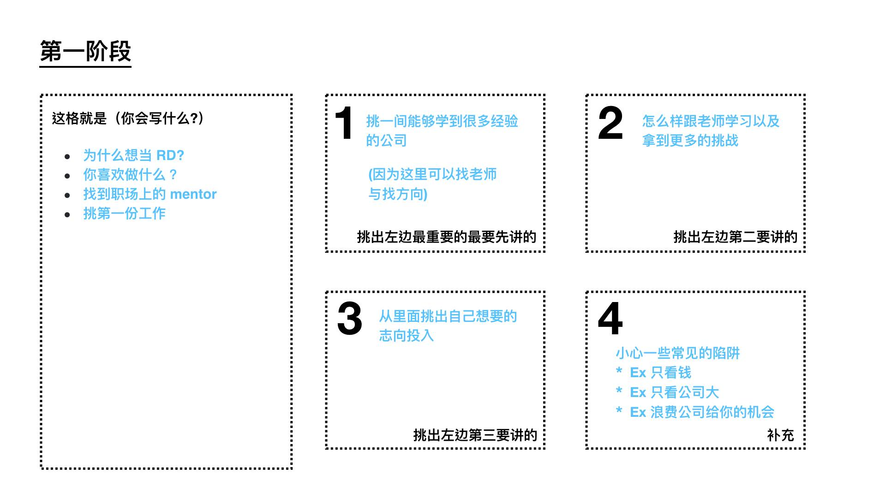
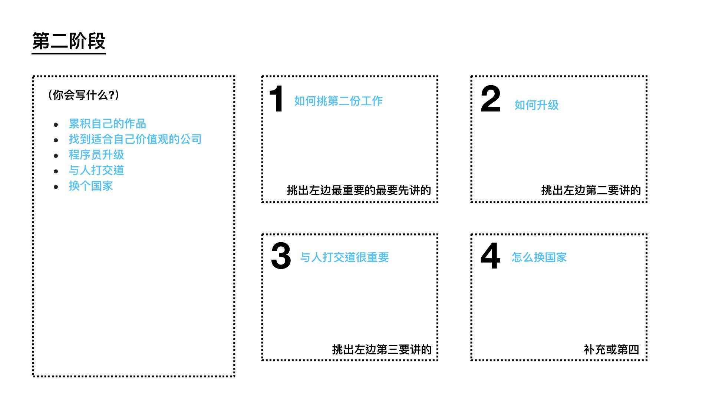
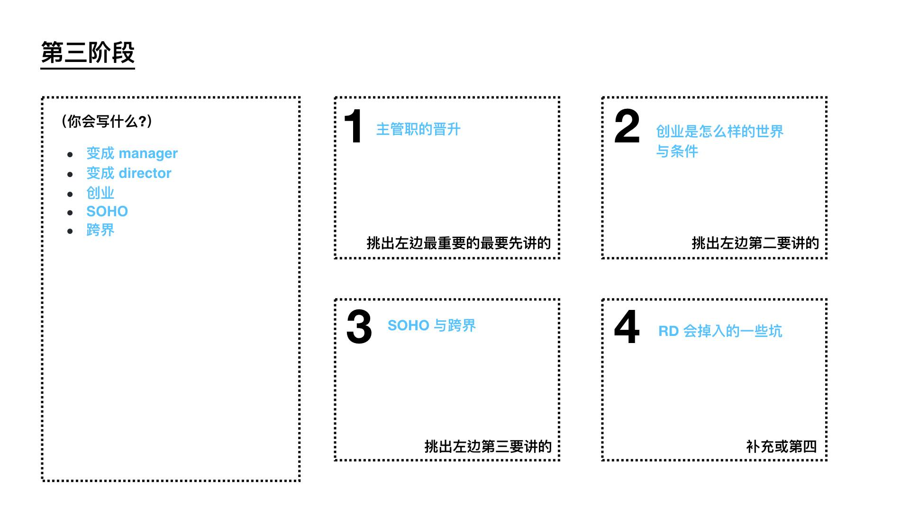

# 小部分解

经过我们上一章节的拆解。相信读者们会对写书的流程有了一个比较清晰的认识。也大概知道长篇写作怎么规划。

## 如何“创造”灵感

最早的时候，我虽然不太懂写书。但是写文这件事，对我还是蛮容易的。随便一篇都可以写出一篇2000-3000字的博文。

周遭的朋友都很羡慕我。但是老实说，我真不知道为什么我自己有这样的功力。后来，我听它们抱怨写文上遇到的挫折，我才知道“一般人”写作的障碍。

我通常写文章呢，是一口气写完的。也就是今天如果我想写一篇文章，大概在脑袋里面想完，于是打开编辑器一口气就写完了。所以写作速度很快。但也不是没有弱点，我的速度只有两种，一种就是 0，完全写不出来。一种是 3000，瞬间就能写 3000 字。完全取决于，当时有没有“灵感”。

而其他人的写作，是边写边查资料，所以一边写文章一边查资料，所以写得巨慢无比。

当我开始搞明白，所谓“灵感”是怎么回事之后，我就开始知道要如何治没有“灵感”这个毛病了。

“灵感”本身取决于两个因素：

* 思绪连线
* 脑力能量

缺一不可。也就是想不明白，就写不出来。脑力低下，也写不出来。

而绝大多数人的“没有灵感”，其实指的是“思绪构不成写作线”。

凑不成线主要有几个原因：

* 脑子混乱，脑袋同时有太多事情想讲，表达不出来
* 没把这件事情想通想明白
* 根本不懂

### 想说的话太多，塞住喉咙

这个方法是我在“说出影响力”这堂课。谢文宪宪哥教我的技巧。当时我的演说技巧不是很好。他给我的个人指导建议是，如果你脑子里一次有太多事想讲。就想想，“如果只能讲一件事”，你会讲什么。

同样的。在写作方面你也可以用同样的原则。我建议写作方面，如果你一次想要讲很多事情，可以拿一章 A3 纸，想到什么关键字，就写下来。

一口气写下来，你会发现这一堆关键字，什么是重要的，什么是次要的。将关键字排出优先级，圈在一起，用线连起来。

你可以快速知道，自己该先写什么，后先写什么。

### 没想通整个议题

如果用这种方法，你还是写不出来。那代表你没想通这些关键字当中的逻辑。这里我推荐你用一个框架去整理脑袋中的资讯：

* 什么是？
* 为什么这很重要？
* 能举例吗？
* 能多举几个例子吗？
* 我能不能举个反例
* 最后打个比方

用这个框架去填你想要写的内容。

测试自己有没有理解这个主题的关键在于“能不能打个比方”。有很多人往往以为自己懂某个议题，但是却打不出比方。这其实是因为没有搞通这个题目。

教育学将认知领域分成六个阶段：

* 记忆
* 了解
* 应用
* 分析
* 评估
* 创造

能不能“打个比方”，是“创作”这个阶段的高级能力。如果无法“打个比方”，通常表示你没搞通这个道理，顶多只到“应用”这个层级。

### 根本不懂

根本不懂。是写作里面最糟糕的一种状况了。很多人写文章时卡住，是因为一边查一边写。

处在这种层级是最惨的了。因为写作是很耗能的、而学习也是很耗能的。更何况一边学习一边写作、这就像是只能举二十斤的人，一口气想举两百斤一样，被压垮是很正常的。写不出来跟“灵感”完全无关。

所以这世界上不可能存在“一边学习、一边写作”的灵感改善法。只有“弄明白”“再写作”的方法。

如何快速研究一个主题。也是可以用同样一套框架，只是用来写自己的“研究报告”：

* 什么是？
* 为什么这很重要？
* 能举例吗？
* 能多举几个例子吗？
* 我能不能举个反例
* 最后打个比方

多读几本书，当你能把想表述的几个议题的“研究报告”写完后。自然就有办法生出一篇文章了。

比如说当我要去研究一个领域时，我会把 Amazon 上面这个领域，比较有名的书籍都买回来。然后挑一篇“我的程度”看的懂的书，开始反覆写这些研究报告与读书心得（请参考<极速读书法>）。一边写你就会发现作者推荐相关的书，多本书里面提到的共同思路。最初你有兴趣的主题，也许有 15 个看不懂的关键字。等你把当中大约 10 个关键字都弄明白后。文章大概也写的出来了。

## 如何解决创作上的困难

创作困难还有两种情形：

* 不知道要写什么主题。但一旦有主题写很快
* 写不出来自己想要的味道


### 用群众智慧解决写作方向问题

有的时候，写不出来，是因为知道太多。倒不知道自己可以写什么主题。一旦有具体的主题，写文章可以非常的快。

这时候你可以用群众智慧法。开一个问卷调查。请亲朋好友列出问题。等你搜集到几十个问题。大致上就可以找到很多题目了。比如说，我之前想要写一本价值投资的书，我就请编辑部帮忙搜集题目。然后瞬间就搜集到几十个问题，找到之后，再进行分类。瞬间你就发现，可以写的题目实在太多了！

* 基本的投资常识
  - 所谓的“炒股票”是怎么一回事？
  - 有哪一些股票投资商业名词不可不知？
  - 投资有什么优点？
  - 为什么是十年十倍？
  - 投资股票有比赛规则，有没有弃赛原则？
* 海外投资
  - 不同国家之间的股市会有哪些不同的特点？如：投资风格、偏好投资哪些产业
  - 想跨国投资外国股市有哪些注意事项？
  - 各国政府监管股市的做法？投资者该如何因应？
* 如何解读市场消息
  - 除了看财报之外，还需要注意哪些消息来源？
  - 如何判读市场消息的正确性？
  - 如何判读媒体炒作市场？
  - 在投资不同产业的股票时，是不是都必须先了解该产业的产业链及产品资讯？如果是，有没有什么技巧？
  - 对一个企业的“市场观感”会影响投资人是否投资该企业的比率大概有多少？
  - 国际间不断有“贸易战”等影响股市的事件出现，投资客们要怎么看准时机做出对应措施？
  - 老上市公司在转行做不同类型商品时要特别小心，实际上可以有什么作为？
  - 看好的股票下跌很多
  - 大家说要反弹
  - 别人跟我说时机很好
  - 跌到历史低位
* 抄底
  - 如何判断要不要抄底
  - 如何判断哪里是底
  - 如何判断哪里是顶
* 大盘
  - 如何跑赢大盘
  - 紧跟着大盘好像比较轻松省力？
* 投资者心理素质、投资能力
  - 怎么放心
  - 怎么加速学习
  - 投资者需要具备什么基本能力？如何学会这样的能力，并能实际运用？
  - 该如何获取股票投资的基础观念？
  - 该怎么订定投资目标？
  - 怎么样才不会跟着风向买？
  - 怎么样炒股不干扰上班
  - 怎样才不会掉入赌博的心态？
  - 投资股市时不该抱有“博弈”有的心态，那有所谓“正确的心态”吗？怎么忍住冲动？
  - 大跌时如何稳定持有？
  - 建议新手买几张股？怎么选股来练习？
  - 懒得卖
* 投资者个人经济状况
  - 怎么样的经济状况适合做股票投资？
  - 钱很多想乱买
  - 钱很少只能买一家公司怎么办
* 配仓
  - 怎么配仓
* 价值投资和其他类型投资的对比
  - 价值投资就是指数型投资吗？
  - 为什么不推荐投资虚拟货币，要做价值投资？
* 如何选股、分析公司
  - 怎么样找到白马股
  - 怎么知道有没有突然变坏
  - 如何找到被低估的股票？
  - 所谓“潜力股”符合哪些条件？
  - 如何挑选适合自己股票？
  - 如何看出财报作假？
* 如何赚钱
  - 怎么样躺着赚钱
  - 如果想短期操作，有什么最快入手的方法？
  - 股票有所谓涨到多少程度就脱手的规则吗？有的话，技巧为何？
  - “提前一、两年”买好公司股票，具体来说该怎么做？
* 如何规避风险
  - 怎么样不亏钱
  - 股票“接下来要赔钱了”一事可否预测出来？可以的话，能采取哪些对策？
  - 赔钱的底线在哪里？
  - 如果手上已经有不值钱、赔钱的股票，该如何脱手或处理？
  - 怎么样防止被套牢
  - 如何避免在错误的时间点进场？错误的时间点卖出？
  - 台湾有些公司上市和上柜就是为了捞一笔，怎么样才不会去买到他们的股票？
  - 怎么样不被贸易战杀到
* 这些情景下要不要买
  - 最近涨的多
  - 朋友说这只股近期可能涨
  - 历史表现都是涨的
  - 能不能抄底
  - 新闻报道利好
  - 政策
  - 内幕消息
  - 猪瘟
* 这些情景下要不要卖
  - 涨太多
  - 新闻事件
  - 横盘很久
  - 别人的股票涨我的股票不涨
  - 套太久了
  - 朋友说这只股票不好
  - 朋友的股涨的比我好比我高
  - 缺钱
  - 看到更好的
  - 内幕消息
  - 贸易战
  - 猪瘟

### 写不出来自己想要的味道

有时候，文章是写出来了。但是改来改去。原因在于

- 标题不好下。下了好标题，内容却不是那个味道。
- 内容写出来了。但是文章自己都觉得不好看
- 文章看完没有转发的冲动
- 文章看完以后观众不想留言

所以边写边改、越写越沮丧。

各位读者不要着急。这是因为你不知道网上别人的 10W+ 神文是怎么生产出来的。

早些年，公众号还挺火时，有些朋友的公众号，天天都能产生神文。我也很想学习这一类学习技巧。后来有幸认识几个神号主编，才知道人家的文章也不是一次就写出来的。

一篇文章我们可以拆解成“题目”、“内容”、“行动”。

#### 标题

我们先来讲讲“标题”吧。其实在绝大多数神号里面，标题都是最后才取的。你没有看错。是最后才取的。我们就拿前几年超级大号“咪蒙”来说吧。它们一篇文章的标题在出品之前，就有上百个待选标题。是经过内部投票、死忠粉丝群内测（出刊前至少有5000-10000人以上看过）才选出来的标题。

在比较正规的自媒体部，一般都是至少5-10个编辑。针对一个暂时的标题，大家针对同一个“暂时主题”，同时好几个人写。写完 merge 起来，才后制的。

所以如果你着急自己标题取不好的话。标题这个东西，跟一本书的“前言”差不多，最后再来取就行了。

#### 行动

一般在公众号、知乎的文章有不同目的。

公众号的文章多半是希望读者“留言”“转发”“下单”。

而知乎的文章是希望读者“留言”“点赞”（让演算法可以靠前）。

“行动”也称之为 CALL TO ACTION。所以如果你要让读者引发行动，也是后制出来的。看你是希望读者做什么样的行动。在最后关键再改稿修回去。

#### 内容

说到这里，你心里该不会想。不是吧。内容引人入胜难道也是后制出来的。是的。你猜对了。也是后制出来的。

关于写作。我可以推荐你两本书：

- 爆款写作课
- 人人都能学会的刷屏文章写作技巧

这两本书可以解答你很多问题。

当然本书后面，我们也会谈一谈相关的技巧

## 如何正确使用坊间的“作文”课与“作文”书？

我想，很多朋友在读我这本书时，其实都已经是死马当活马医的情况。

觉得写作真是一个超难的技能。不管上了多少堂的写作课以及买了多少写作书，自己的写作能力还是没有改进。

这是很正常的。因为。你用错方法了。很多人，以为上了这些课、买了这些书，就能“产生”写作能力。

而事实上，这些课、这些书的正确用法，是拿来让你“改文”的。如果你已经有文章的话，这些课会对你很有用。随便一个老师教给你的技巧，肯定可以让你跟着“改”，就改成大文豪、爆款作者。

但是。它们真不是拿来学“产生”文章的。甚至可以这样说，市面上 90% 的课与书，都对“生文”能力没有效，对“改文”才有效。

所以真不用再浪费时间了。你看到的神文，都不是一镜到底写出来的。全都是后制加工出来的。所以要 GET 写作技能，你要练的是如何人工制造灵感，练到能够批量生产出文章。

一旦有办法生出文章，后续“改”文章反而简单。

## 如何批量写短文 --- 学会使用 ORID 归纳框架

如果你真的没有什么写作能力。这里我推荐各位一个框架，叫“ORID”。引导式讨论法。其实这也是人类的自然思考流程。

你平日可以用这个框架练习写作，搜集素材。我在上一章写书法时提到“针对时事评论”累积素材。就可以按照这个格式。

1. O-“Objective”：观察外在客观、事实。了解客观事实的问句如下：
  - 看到了什么？
  - 记得什么？
  - 发生了什么事？
2. R-“Reflective”：重视内在感受、反应。唤起情绪与感受的问句如下：
  - 有什么地方让你很感动/惊讶/难过/开心？
  - 什么是你觉得比较困难/容易/处理的？
  - 令你觉得印象深刻的地方？
3. I-“Interpretive”：诠释意义、价值、经验。寻找前述意义与价值的问句如下：
  - 为什么这些让你很感动/惊讶/难过/开心？
  - 引发你想到了什么？有什么重要的领悟吗？
  - 对你而言，重要的意义是什么？学到了什么？
4. D-“Decisional”：找出决定、行动。找出决议和行动的问句如下：
  - 有什么我们可以改变的地方？
  - 接下来的行动/计划会是什么？
  - 还需要什么资源或支持才能完成目标？
  - 未来你要如何应用？

学会一个东西。就用这种格式法写下来。

甚至每天也可以养成一个写日记（使用 ORID ）的习惯。

之前我规定全栈营的学生，每天上课回家作业，要写一篇 ORID 记录当天所学。很多学生用这个格式连写了 60 天。60 天过后，很多人竟然从 0 作文能力，变成了随便博文至少篇篇 2000 字，公众号还可以日更。

它们开玩笑说，本来是交钱来学编程的。没想到毕业之后，连写作技能竟然都莫名其妙学会了。

ORID 会很难吗？其实也不会。ORID 本身就是人类思考的模式。这里我拿过去一篇 Aeron 推坑感想文做示范。你就知道 ORID 是怎么回事了？

如果你真的写到山穷水尽，没有什么灵感。不妨可以用这个方式去做短文引导写作。

单纯只记录感想，收集起来。等以后有「灵感」时，再剪进去正文里面。

## 所有文章都可以使用这套方法吗？

当然没有办法。这套方法仅限于叙述文与论述文。

而关于生产商业文案以及营销文，有其他的写作架构方式。我们会在本书后面提到。

我只是要说。其实，关于写作，很多人都把“写作”当成了“一回事”。其实这门学问里面有很多“分类”。

而因为我们人类天生就懂表达，所以很直觉得认为“写文章”没有特别技巧。只要“客服了灵感”，自然就能“一镜到底”写出任何的文章。

我们这一两章的解构，就是让各位读者理解。其实各位看到的“神迹”、“神文”，都是后制出来的。你可能会觉得这些方法看起来很“作弊”，但是让我们把视角领域 shift 到“拍片”，你就不会觉得这些“框架”技巧难以接受甚至过于玄幻了。

当然，写作能力的提升，还是有待于各位读者的练习。只是，如果你能有效解构“写作”这件事，你会发现，其实写作并没有各位想像中的困难！

### 我如何快速写作

那么。我平常是如何快速写作的呢？现在我为各位读者归纳一遍我平常的写作方法。

慢速版

- STEP 1 : 用笔写一份 ORID
- STEP 2: 拿出 Outline 看着 ORID 写一份大纲稿
- STEP 3-1: 如果文章太长，我用讲的，再对着逐字稿，写一份正式稿
- STEP 3-2: 如果文章一般。我直接用写的
- STEP 4: 使用文章技巧后制

快速版：

在脑袋里面直接 STEP 1~4。去洗个澡想明白后，一镜到底直接写。

现在各位知道所谓“灵感”是怎么回事了吧！

## 再谈如何批量激发灵感

写到这里如果你还是没有灵感呢？没关系。我们还有最后的一个绝招，就是　-- COPY。

看到这个字，你一定会大惊失色。这不是一堂原创写作书吗？作者怎么会想要教我们抄袭。

是的。我没有要教你"抄袭"。所以本章才用一个比较中性的英文词 COPY。

### 这个世界其实大家都互相在 COPY

当你读了越多书，见识过更多领域。你会发现世界上其实没有什么新鲜事。只是不同的"套路"在不同的领域大量的重复。

有时候你可能发明一个东西，觉得自己是原创很兴奋。结果过了一两年。竟然会在另外一个领域，发现已经有人甚至早你几年，甚至早你几十年就发明了同样东西。

双方是在不同契机但相似同的条件下催化，所以最后有著类似的结果。

这本书前两章。眼尖的读者，其实可以发现，我来来去去谈的都是同一个话题：「结构」。

写作之所以困难。在于大家被一个「词」困住了。这个词，就是所谓的「灵感」。而最令人感到无奈气馁无解的事，就是基本上不管是网上什么写作课、写作书，只要谈到「激发灵感」这个章节，往往写的跟瑜珈书没两样。

这也是为什么在这本书里面，我用了大量的例子，为的是让大家看到：所谓灵感并不是"一团毛茸茸的能量球"，而是一个个棱角分明的结构。

事实上我们写作便秘的时候，并非是没有「灵感」，而是所谓「灵感」其实就是我们的一段散落记忆。写不出来是因为我们大脑没有使用过一个恰当的「结构」去将这个记忆好好的安放呈现。

### 同行的叫抄袭。但 COPY 异业的叫借鉴

以前曾经上过一堂商业文案课时，这堂课是练习写软文的。老师上课讲完了软文结构以后，给了我们一篇母婴电商软文、还有一篇瑜珈课程软文。然后要我们回去把这两篇文章改成自己领域的内容。只给我们1 个晚上的时间写。

这个作业超级神奇。隔天上课的同学，还真的魔改出了一篇超級銷售神文\...\...Orz

老师还给我们讲了个段子说：软文文案这东西根本没有原创，因为万用推坑框架就那几套。你只要注意，千万不要COPY 到同行的。COPY 到同行的叫抄袭。但 COPY 异业的叫借鉴。

### 你的创作是基于你过去人生体验的重新组合

我在音乐界也看到类似的例子。

知名音乐 youtuber 官为为在他的 Youtube 频道 NiceChord

好和弦当中一部作品「沒有靈感怎麼辦：「特徵清單」抄襲法」也谈到：

他更进一步的谈到，一首曲子可以分成以下结构：

 
所以如果作曲家灵感枯竭的话。可以怎么样激发灵感呢？

作曲家的作法可以试著去把完全不搭嘎的几首歌完全拆开。找寻可用的特征

最后再把这些特征 Remix 。也许就可以创作出一个全新旋律。

而这是抄袭吗？

wiwi 对于 COPY 这件事。他的看法是这样的：

> 我不晓得你在创作的时候会不会担心你正在做的东西不够原创，好像什么东西都有人做过了，这世界还有差我这个作品吗？我以前常常会这样子想，但是随着我越来越老，我就越能体会到太阳底下其实没有什么新鲜事，其实没有什么东西是原创的。你写的歌里面主旋律用的音阶不是你发明的，唱的歌词的文法也不是你制定的，使用的乐器也不是你自己制作的录音技巧，也不是只有你会毁音时的各种效果也不是你第一个用的

> 所以你现在创作的时候做的决定其实都是根基于所有在你之前的人类做的研究，以及你在这个世界上这段时间所有的人生体验的重新组合而已，根本没有什么东西是原创的，但这并不会让你的作品变得没有意义，因为还是只有你可以把你自己的人生经验用你自己的方式呈现出来。

### 常见文章的七种结构

这就是为什么这本书花了这么多时间在谈「结构」。

书可拆成章节。章节可以拆成文章。文章可以拆成标题、内容、行动。创作者之所以之前会「跑」的那么辛苦。其实是不知道要先「拆」而已。

如果你在写作时还是没有灵感。我这里可以提供七个常见写作模版。叙事、论说文，其实来来去去就这六个结构而已。

这六个结构，我是剖析过知乎超过一千篇千赞文章，所找出来的文章结构。

千赞文章列表 <https://zhuanlan.zhihu.com/p/67447763>

#### 如何做　How

-   以前的我
-   后来的我
-   再后来的我
-   我发现
-   别人也许不同意
-   但是我是这样看的
-   建议

要怎样努力，才能成为很厉害的人？ - 朱炫的回答 - 知乎
<https://www.zhihu.com/question/22921426/answer/23330366>

体质极差的人该如何从头开始恢复身体素质？
<https://www.zhihu.com/question/20381470>

如何与父母断绝亲子关系？ - 莊謙的回答 - 知乎
<https://www.zhihu.com/question/22561592/answer/23108777>

#### 为什么?

-   叙述一件你见到或别人报导的情形
-   问题来了，你观察到事实与\[题目\]相反？
-   例子 1
-   例子 2
-   推论 1
-   推论 2
-   我认为
-   也许这件事
-   加上一个感叹

为什么中国男足踢不好？
<https://www.zhihu.com/question/21223279/answer/27324884>

#### 什么是？What is

-   一个经典案例，定义了\[题目\]
-   我的反应
-   深入论述
-   我认为
-   在我看来

什么是爱？爱一个人是什么感觉？ - 盐选推荐的回答 - 知乎
<https://www.zhihu.com/question/20875474/answer/815365170>

#### 如何看待

-   首先清理观点
  -   定义
  -   举个例子
-  当 XXXX 时，就会发生 YYYY
-  假设 XXXX
-  以上说明了。
-  皆下来问几个问题
    -   Q1, A1
    -   Q2, A2
    -   Q3, A3
-   感叹

如何看待抵制B站的宣传片《后浪》的行为？ - BLUE的回答 - 知乎
<https://www.zhihu.com/question/392763695/answer/1202122234>

#### 是什么

-   一句话或一个词（精确定义）
    -   ex 1
    -   ex 2
    -   ex 3
-   想想看，其实总归就是
    -   pattern 1
    -   pattern 2
    -   pattern 3
-   感叹

男女交往中男性的核心竞争力是什么？ - ccc zhao的回答 - 知乎
<https://www.zhihu.com/question/23513628/answer/24826186>

#### 可以吗？

-   我个人的故事
-   但我知道做这件事可能行，可能不行（看题目定义）
-   让我们来做个实验
-   结构（大好、大坏）
-   如果你想
-   我的建议

美国那种完全不喝水，只喝含糖饮料、啤酒或牛奶的人，健康会出问题吗？ - 丫丫奶昔的回答 - 知乎
https://www.zhihu.com/question/396124015/answer/1236574232

#### 套回大纲

然后我们再套回来

你是不是发现什么秘密了呢？
