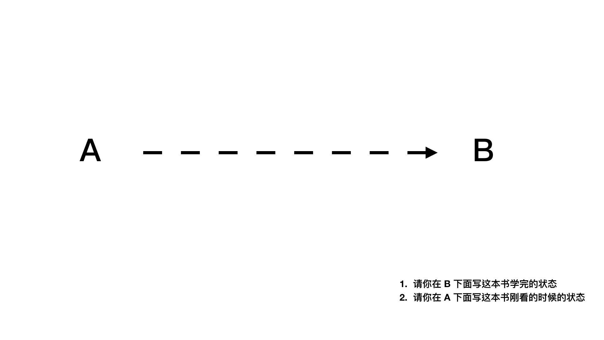
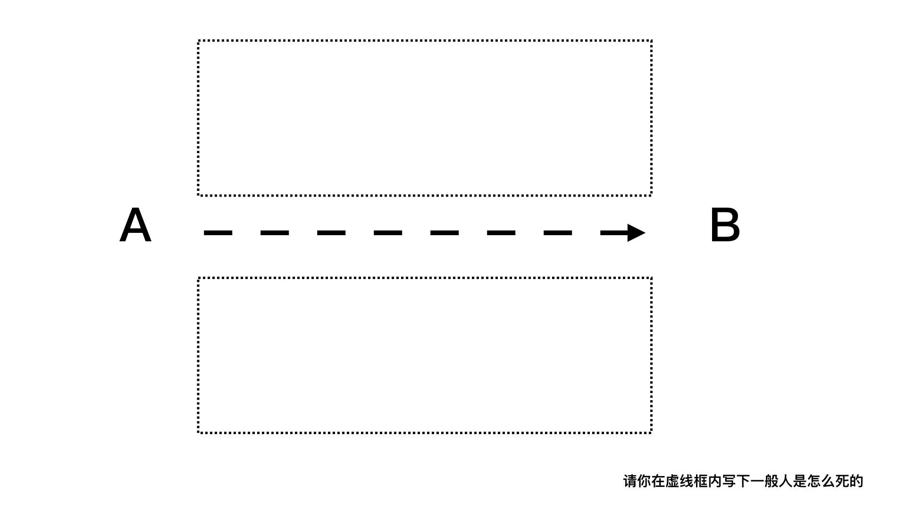

# 第一步：确定这本书的读者是谁

写书最重要的第一件事，就是确定读者。
这件事非常基本，但是几乎很少「首次作者」做得好。

我知道许多想写书的作者，写书的目标是想要造福越多人越好。

所以，很多「首次作者」的写作目标是「所有人」。 --- 这也是种下「写不完」结果的「第一个原因」。

而第二个原因是，如果问这些「首次作者」，它们期待读者看完书之后，读者会得到什么能力。

这些「首次作者」，会回答：「变得跟我一样」。

所以综合一下，它们的写作目标是：写一本「给所有人看完就会变得跟作者一样大师水平」的书。

喂，你不要偷笑。读者看到这里应该很想笑。

但是不盖你，所有陷入写不完地狱的作者，它们之所以鬼打墙永远在修稿的原因，就是因为它们想写一本「给所有人看完就会变得跟作者一样大师水平」的书。

所以才会永远卡在前三章写不完.....

这样的情形才会一直出现。

一直加料一直修改，加到最后写不完、改不完。因为无论写到哪里自己都觉得写到一半歪楼了，想重写。

而这也是出版社编辑最头大的地方。

出版社在跟「首次作者」签约以后的第一个会议，往往是请作者先设定这本书的目标读者，然后就会出现「所有人」这个答案。

而不管编辑如何怎么道德劝说，作者还是会热血博爱的不改其志。

我认为，编辑不应该这样问作者，而应该将问题修改成：「你期望读者，在看完这本书之后，有什么样的状态改变？」

因为，即使编辑不管怎样道德劝说，還是无法改变作者「想要写给所有人」的这件事。那还不如改变角度，劝说作者应该设定一个目標，就是在普通人能力有限的情況下，看完这本书後，明确能达到的能力上限。

所以開始寫書的第一步，就是先列一个 A 点。A 点是一个白纸状态。而 B 点，是作者认为作为你的学徒，应该要达成的具体能力。（B 点绝对不可以是作者现在的功力）

而第二步，是把一般人从 A 点走到 B 点的困难列出来。

第三步是，将这些问题反向列出来解法，并且归类。

我举我过去几本书的例子，你就知道我是怎么写的了。

### 书例：闪电式开发

比如我的「闪电式开发」，是写给只会写代码的程序员看的，这些程序员很羡慕我能够创业成功。但是他們在创业期间，只要遇到以下其中的一個困難，就会害它们死掉了：

* 不知道做哪个 IDEA 比较好？
* 不知道那个 IDEA 会赚钱？
* 莫名其妙踩到一些小坑就死了
* 做完产品以后却错过风口了
* 找到黄金团队，开发速度却龟速如牛
* 产品上线后却没有人会用
* 产品上线以后发现要打掉重做
* 产品上线两次改版以后没钱黄了
* 产品上线以后赚不到钱
* 产品上线以后用户无法增长

所以具体来说反过来，我可以写的题目是

* 如何鉴定哪一些是可以做的 IDEA
* 哪一些是可以赚钱的 IDEA
* 创业路上常见的小错，但是犯了就会挂掉
* 如何抢在风口上线
* 如何快速开发可行性产品
* 如何开发出上线就有人要用的产品
* 如何开发出上线就有人要用的产品
* 如何上线两周之内就能找到正确改进的方向
* 如何上线后能够持续赚钱
* 如何上线后能够持续增长

然后整理出来。我就有了 3-4 个具体关键字 Section 了。分别是

* IDEA 篇
* 协作篇
* 打磨篇
* 增长篇

### 书例：打造超人大脑

这本书是写给想要增长自己的能力的「所有人」，是写给困在原地无法成长的青年看的。我希望它们看完以后能够运用一些简单的技巧与概念打破增长天花板。那么，它们平时会遇到什么困难呢？

* 看书慢
* 学东西速度慢
* 学东西容易忘记
* 写文章慢
* 企划能力低落，遇到事情容易卡关
* 容易对事情三分钟热度
* 容易不幸运
* 觉得学新事物费劲

所以具体来说反过来，我可以写的题目是

* 普通人如何拥有快速阅读能力
* 如何可以快速上手一门学问
* 如何学完东西以后不容易忘记
* 如何容易写出一篇文章
* 如何破解眼前的难题，不容易被卡住
* 如何设计一套机制，让自己不容易三分钟热度
* 如何找到自己的幸运公式
* 如何破解学新事物的心魔

然后整理下来。本来我在写这本书的时候，觉得只会有两个关键字而已。

* 输入
* 输出

没想到新增了一个：

* 持续成长

### 书例：远距工作这样做

这本是我最近出的新书，讲远距工作的。目标读者是原本不熟远距的工作者，希望它们读了这本书后，可以改善效率问题。它们的问题有：

* 远距后沟通很费劲
* 工作换手交接很困难
* 开会非常占据精力
* 工作进度满天飞，没人能确切掌握小组进度
* 在家工作功效效率低下
* 远程沟通时，工作气氛不良
* 担心远程文件，传递时机密泄漏

这个领域会发生的问题属于比较杂的问题。但其实还是可以归类成两组问题：

* 沟通问题
* 其他问题
