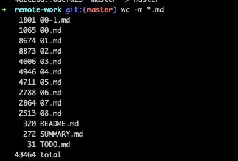
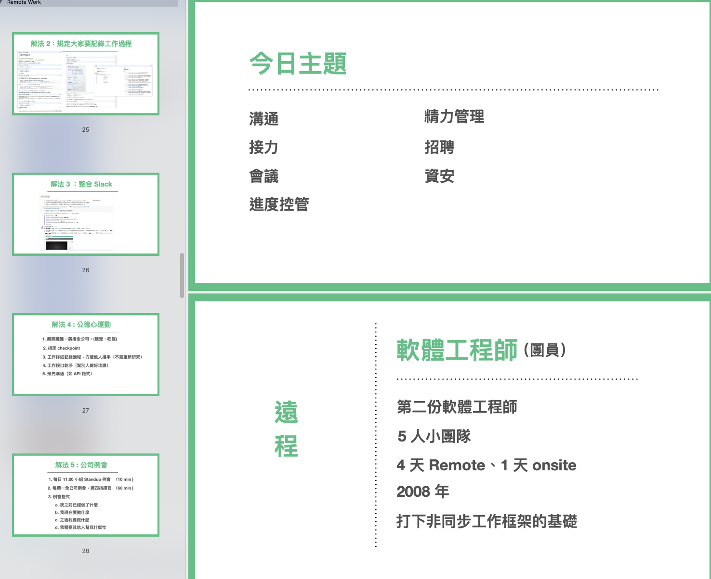
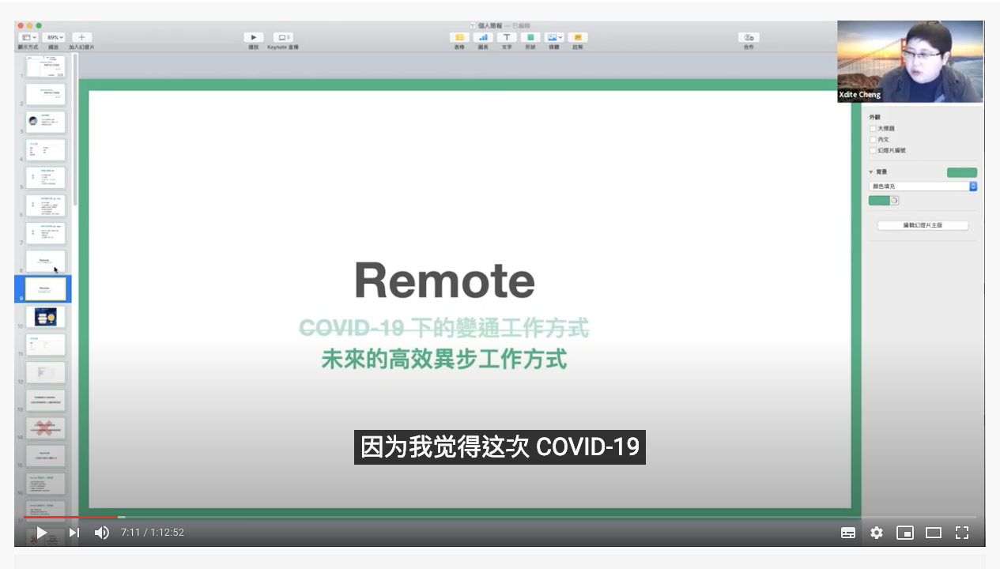
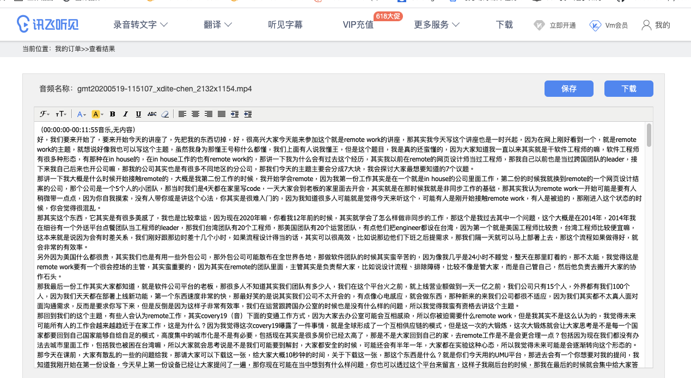
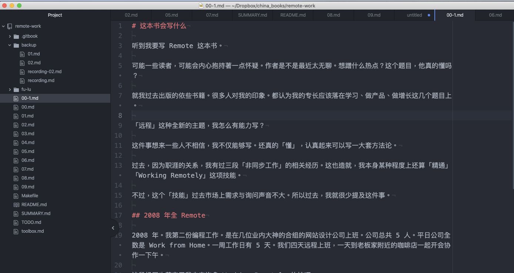
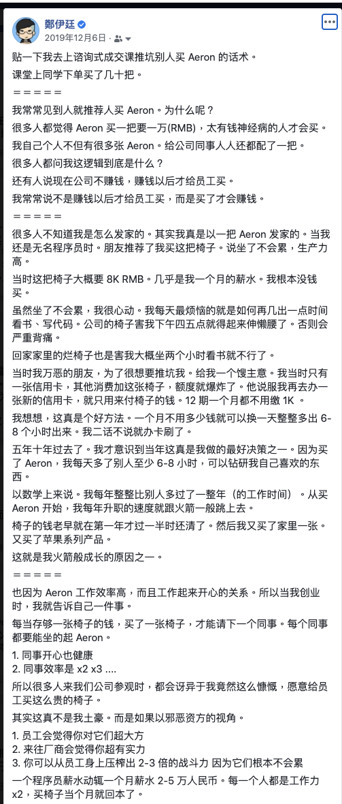

# 一天写出一本书的高产配方

在我改用 Outline 写作法后，我一天最高产大约能写 20000 字，大概就是 3-4 篇长文。

后来我就在思考，能不能把这个数字拉上去？也许是 40000 字，也许是 60000 字，也许更狂的，一天写出一本书？

当然，这都只是幻想而已，正常人怎么办得到？

我过去最厉害的纪录，也只不过是一周写出一本书（打造超人大脑）。那一次已经把自己搞到筋疲力竭了。

只是没想到这个狂想，后来却成真了。

在某次直播中，竟然无意中实践出一个神奇的方法，可以办到这件事。

大概是在 2020 年 5 月吧，有次在与朋友闲聊时，朋友就说因为疫情的关系，现在远距工作很夯，未来远距的非同步作业技巧应该会成为上班族必备的技能。我说：说来你不知，虽然我号称懂王（因为会太多东西，被酸民以为是假懂，所以讽刺我什么都懂），但是远距工作这个议题，我真的非常懂。

当时其他人也没在意。

但是因为这个话题我真是非常熟稔，毕竟是过去十多年上班练就的非同步工作技能。于是早上刚聊完，我就宣布晚上要开课（最终来了 30 人）。不仅如此，跟以往直播课不同，我还真就认真做起了一个50 页 PPT。

这个 Talk 讲了大约 1 小时，原本我这些朋友，以为我闹著玩的，但听玩了以后却都感到很震撼。因为大家发现这个议题我不但是懂，而且是懂中之懂。

这件事还没完。我讲完以后觉得很 High，意犹未尽，竟然就花了 24 小时，写了约 44000 字，把这本书的 V1 写完了。

这个举动真是吓到周遭所有人了，也吓到我自己！因为连我自己都没想到可以一口气写这么多字。

不过这个举动真是太過冲动，没做好配速，原本自己觉得可以上 60000。最后写了 44000 就没力了。

(可以看到我刚开始可以一次写 8000，后面就只能一次写 4000，然后就掉到 2000)

我是怎么做的呢？

#### Step 1: 画 A-\> B

刚开始我本来都没有写书的念头，所以只是抱持著做个小课的想法。

透过这个梳理，我发现大家比较关心沟通的几个议题：

#### Step 2: 打投影片 Outline

然后，我就开始写投影片 Outline：

#### Step 3: 然后做成投影片

#### Step 4: 上 Zoom 直播

#### Step 5 :  转档成逐字稿

#### Step 6 : 重写成书稿

然后我看著这些逐字稿的大概内容，重写（这次不是剪辑搬运逐字稿，是看著稿子空手切块重写的\...）

因为空手写，后面体力就下降的超快。早知道我应该要对书再打一次 Outline 的：

因为这本书写的如此之快、内容之深，编辑也是瞬间就跟我签了这本书的出版合约。

当然，这个 V1 版本并不是这本书出版的最后版本。下一段我们会谈如何后期打磨。

## 后期制作

当然，写书不止是光靠思绪的储备，就能写成一本书，那只能写成一个比较粗的大纲本。

### 如何添加例子：平日多写心得与现象评论

写书时，为了让观众明白。有时候章节里面必须举一些例子，让读者明白你想要该章的论述。但是，其实例子没有那么好生。

有时候写书卡住，其实不是论述卡住，而是例子卡住。因为有时候临时要生个完美例子，实在是非常非常的困难。

所以这反而要靠平时的素材累积。

之前有加过我 Facebook 的朋友，知道我常常有时候会「灵感一来」，就在Facebook 上写上一段没头没尾的感想。

可以是旅游感想、败家感想、上课感想、愤怒的情绪发泄。

而这些文字，好一时候，我才可能整理贴回去博客上重新发表。

如果不想整理回博客的，我只会贴回我自己的笔记簿里面。

时常写这些杂文与博文，有时候有一些很大的好处。就是你永远不知道何时知道自己需要这些素材。

像我的「闪电式开发」一书，里面很多的实际例子，就是我由自己的博客上过去整理的技术
Best Practices 剪辑而来。

比如说，我曾经有次有感而发，写下买 Aeron 真是值回票价的感想。

这一段后来就被我在后制阶段剪进去「远程工作这样做」这本书的工作配置章节。

我出社会不久后，就养成了写工作笔记，写博文的习惯。也就是这些「写下来」的习惯，后来变成了很好的正循环。

我因为写下来。研究东西时，就不用重新研究一遍。因为写下来，我还能把原先想不明白的事情，重想一遍。甚至以后写手册时，只要把过去写的笔记重新编辑一遍，很快就是一本完整的技术手册。让我减少训练新人的时间。

当然，有些人会觉得我不喜欢写博文怎么办？其实，没关系，我后来也不是很喜欢写成博文。因为写成博文挺有压力的。你要取好的标题，你要编辑，贴出来你还要在乎「收视率」。

为了整一篇博文，要做好多多馀的工。后来，我更多的只有「写下来」。

但就是这个「写下来」，变成了很好的题材累积。
