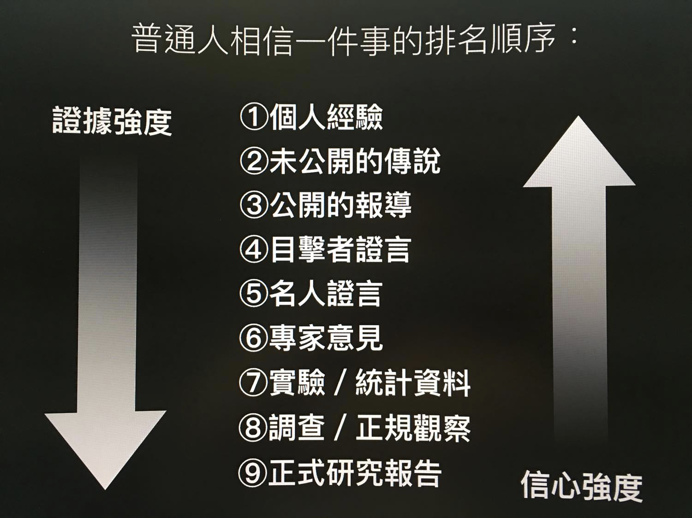

# 如何写出一个好故事

故事有两种来源：

* 一种是自己的
* 一种是别人的

在写书时，一般来说，写自己的故事总是最好的。一来写起来比较快，只要凭记忆就可写出来，一方面是是写起来比较可信。

如果是写别人的故事。寫作時不僅要停下來去查，还要去想办法剪辑成“比较原创”的口吻。其實挺費盡的

看到这里，读者可能会舉手發问。这本书好像都在谈模版。那写故事有好模版吗？

有！

这个方法是我 2019 去上一个营销课学写软文时（媒老板商学院：超级文案与卖货。贺奕棋老师）学到的。

他指出要写出一个好的品牌故事，需要六个元素：

-   \[**一个敌人**\]
    让你（你的客户）产生困扰的因素，你想打败的东西，最终想达到的目标。比如熬夜越来越严重，颈椎越来越重压，食物添加剂越来越多等等，创业是为了解决这些问题，这些问题就是你的敌人。
-    \[**一个猪队友**\]
    同行竞品，指责他们没有做好的地方，比如用糟糕的原材料、糟糕的设计、打乱市场规则，伤害消费者利益等等。
-    \[**ㄧ个英雄**\] 就是创始人、品牌方，你有着和顾客-
    样的问题，然后努力去解决，最后得到了你的产品。
-   \[**一些冲突**\]你在做产品过程中，遇到的一些阻碍。
-   \[**一个修行**\]你是怎样去做产品的，大致的故事经过是怎样。
-   \[**一个失败**\]讲一个你在做产品中失败的经历，或者人生低谷的阶段。这个失败最好是你为顾客的利益，而选择自己承受代价的失败。
-    \[**一场胜利**\]产品搞出来之后，一次大卖、热销的经历。

其实这个方法。也可运用在一般写故事上。如果在写作拾大脑一片空白，可以先写下这六个元素。就很有灵感了。

比如说如果我要写极速写作法出版由来这件事，我可能就会这样整理。

-   敌人：写不出来，老是重写前言与 1-3 章。
-   猪队友：面对白纸一片空白。编辑都不教我怎要写。
-   英雄：我在网上看到一个快速出书的公司。它们帮名人出书的方式，是设计一系列的问题访问它们，最后整理逐字稿变成书。让我有了直播写书的灵感
-   冲突：写书变的轻松了。但改稿真的很累。
-   一个修行：后来我学着去从做游戏的方式，学对内容作分段。然后一边写文章一边打电动
-   一个失败：刚开始花了一个月写书，这个月啥事都不能做。精神又痛苦又挣扎。所以我花了很多时间去各领域，钻研各种能让自己写更快的方法。
-   一场胜利：后来我找到方法后，从完全靠演讲写书，到一个月写一本书，到一周写一本书，后来到一天能写一本书。到后来编辑甚至邀请我写一本关于写作法的书。

### 故事示範：（實際撰寫）

> 我曾经是一个故事与经历很丰富的程序员。一直想要整理过去的经历变成书分享给大家。但是从想写书，到真的写成第一本纸质书。大概也花了快十年的时间。

> 虽然我本身曾是一个众所周知，写文速度非常快的博客主，但是写书这件事，还真不是普通的困难。我曾经无数次自己用各种工具写书。但老是从入门到放弃。因为我发现，在写书上，我老是败在一个难关：完美病，走不出来。明明我有很多想写的东西，却老是在前言与
1-3 章无穷回圈，无限重写与改稿。怎么样也推进不了。

> 最后，有个契机。我在写第一本书时，无意时用一个方法写出来了。这个方法就是课程逐字稿方式。我先做一个课程，然后请人打字变成一个逐字稿，竟然用这种土法炼钢的方式，写成了第一本书。

> 后来，我在网上，看到了一个公司 Book in a Box 公司，它们帮名人出书的方式，也是用预先准备问题的方式，采访名人。最后整理成书稿。我才慢慢破解写作的奥秘。

> 用着土法炼钢的方式，我后来也用一个月的时间，把我第二本书“闪电式开发”写出来。然而，在这个写作过程中，虽然比写第一本书时有条理许多。但是还是非常痛苦。我常遇到改稿、改章节、太痛苦一直逃避写作等等问题。

> 但是，因为我已经开始借由写作书籍这件事，渐渐掌握了制作长篇内容的奥秘。我把遇到的问题，一个一个用跨领域的方法解决。包括使用游戏界设计关卡的方式，去梳理书籍架构。用一边打电动的方式，去激发多巴胺让自己有动力继续写书。。。。等等等。

>  在我写完第二本书之后，我竟然大致整理出一个框架。为了要实验这个框架。我竟然很 crazy
的进行了一个实验，想要在接下来的两个礼拜，写出下一本书，去证实这个方法是否有效。结果没想到，因为这个题目的题材我很熟悉，竟然最后在一个礼拜就写完了一本书。这本书就是打造超人大脑。

> 后来，在一年后，我的朋友希望我写打造超人大脑的续集，刚好因为 COVID-19，我人被困在台湾，编辑看我没有什么事情作，于是希望我花时间把这本书写完。后来，这本书“打造超人思维”我是花时间写完了。但是，因为是勉强写的。对质量还有一些不是很满意。

> 写完“打造超人思维”那一周。我朋友在跟我聊远程工作的事。关于这个主题，我刚好是专家。我对讲这个主题，非常有兴趣。当天就做了一个投影片，晚上小小开了课。因为做这个课的时候，我还蛮 high
的，甚至还跟编辑提议说，因为我在写打造超人思维时，有一些细节不是很满意。而且我认为远程工作这个题目应该很夯，是否可以花一周时间，我写下一本书交换。

> 打造超人思维则 shift 到下一个档期再出。编辑因为相信我的写作速度，就答应了。

> 没想到，因为这本书的题材我太熟悉，加上在写作时，也用了我最近一年累计的一些新工具与手段。这本书，我竟然只花了一天的时间就写出了干货满满的第一版（44000字）。

> 原本以为写完这本书就没事了。没想到编辑在跟我补签“远程工作这样做”时，他觉得我的新型写作方法实在太厉害了，如果整理出来，应该可以造福很多作者与出版社。

> 这就是这本书的由来。

你看。改用这个結構去編寫故事是不是很简单呢？

你只要先把六个关键点找出来，就会发现灵感一下子就冒出来，写都写不完。

不管是自己的故事，或者是网路上的故事，都可以用这套方法去改写。

其实这六个关键点，就是一般写电影剧本或者是故事时，常用的技巧变形而已。

有更长版本的，也有更短版本的。

如果你对写故事很有兴趣的话。我推荐另外两本书，大家可以参考看看：

-   布莱克．史奈德 --- 先让英雄救猫咪：你这辈子唯一需要的电影编剧指南
-   许荣哲 --- 3分钟说18万个故事，打造影响力

都是類似的結構

## 可以用其他方法替代故事写作吗？

有些读者会觉得。写故事难度还是太高。要“灌内容”的方法有很多种。比如说新闻报导、统计数据、专业论文，这些都可以剪进去当作内容的一部份。

为什么偏偏要锁死在“故事”这个格式里面？

我本来也是这样想的。要「灌內容」也可以用其他格式，為什麼一定要用「故事」呢？

但是，不知道为何，当我在读别人的书里面，读到新闻报导、统计数据、专业论文，却老是总感觉很遥远。

反而要是作者将之编成了一个故事，或者是以他自己的角度去叙述个人经验，不知道为什么，我总是会印象深刻。

后来，我在“超越感觉：批判性思考指南”（这是一本心里学的书，探讨人类错觉）这本书里面，意外的发现了答案，人们对各種体裁的相信度是这样的：

而且，這樣的判斷優先順序。與跟一个人的智商高低，是没有什么相关连的。不是智商低才會有這種傾向。而是「每個人都有」這樣的傾向。

这是因为，人们在做判断与记忆写入时，更依赖的是“感觉”与“感情”。而不是冰冷的数字与图表。

就如同上面我提到的，人们对一件事的写入需要“记忆链”作为载体。

如果單純只是陈述论点与数据，并不会对一个人的心智产生任何影响，因为讀者需要锻炼或者亲身经历，才有办法理解。

但是作为一个故事，读者却很容易在听完之后产生共情，进而相信与记忆。

所以，如果你手上有什么体裁。我建议都可以尽量加工成故事版本。这样可以为自己的书籍或文章大大加强可信力度。
